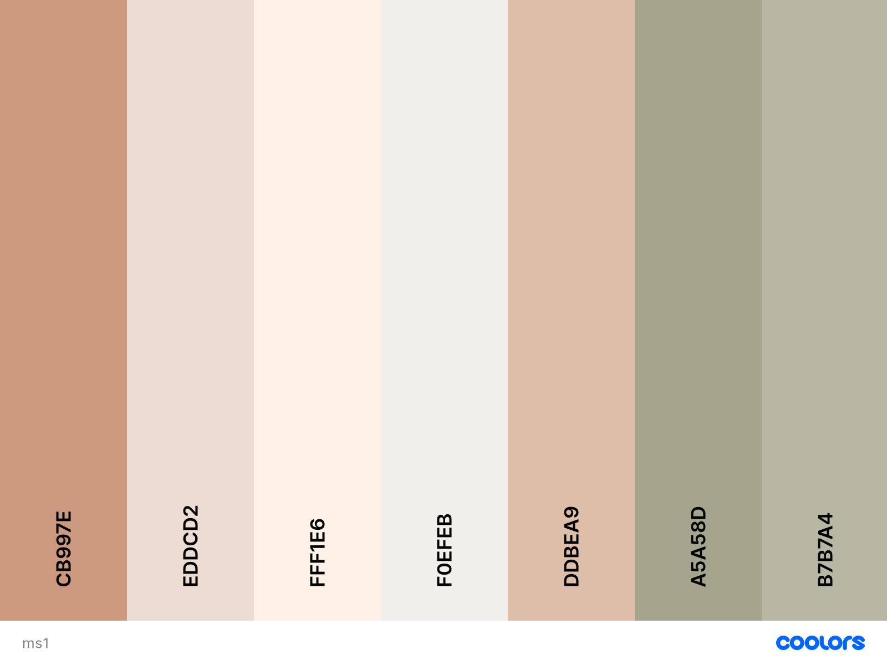
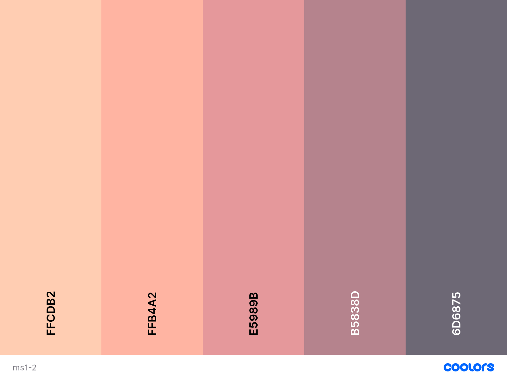

# Girl On Earth.

## Table of Contents
1. [About](#about)
2. [Users Experience (UX)](#user-experience)
3. [Features](#feature)
4. [Design](#design)
5. [Technologies Used](#Technologies-used)
7. [Testing](#testing)
8. [Debugging](#debugging)
8. [Deployment](#Deployment)
9. [Credits](#credits)

## About
---

Girl On Earth is a group gathering like-minded female individuals sharing the same values and metaphors about everyday life, empowering each other to live a sustainable lifestyles.

## Users Experience (UX)
---

#### Users stories

As a high value woman, I want to live my life the maximum by surrounding myself with inspiring metaphors shared by like-minded individuals, so that I can live my life to the maximum aligned with my passions and desire.
As a user I am looking for insparations, new ideas, interesting topics, uplifting spirits.
As a user I am looking for like-minded people to hang-out with, make friends with, and empowering each other.
As a user I am looking for interesting acitivities I can join in to spice up my free time.

#### The Five Planes of UX

* ##### Strategy Plane

  **The aim** is to attract the like-minded women join the group with their own insparations to add value to the group, so the group can grow and inspire more and more women to create a more sustainable lifestyle for themselves, so that the world will become a better place.

  **The target audience** is female individuals that have a strong mindset, knowing what they want to achieve in life and aiming to live their life to the maxmium.

* ##### Scope Plane

  **The home page** should include an eye catching feature with an insparational metaphors to draw users attendation immediately. **The passions section** should include a few of the topics around daily life would interest our female audience. It would be ideal if there are acticles could be linked to this section, but for now the page can be just inclule a basic scope, it can be added as the page grows. **The contact page** should include a form so that the user can get in touch with us.

* ##### Structure Plane
  
  The page is going to a single page with four sections, with a header containers a brand image, a brand name and a navigatiion bar. The home page section structured on the top of the page, followed by an about section clarify what's this page is about. The a big section divided by four individual topics staggered across the entire page with images. Finally there is a contact form for the useers to fill up if they are interested to join in the group. Close the page with a footer has social links and copyright informaton, also another links for the contact form.

* ##### Skeleton Plane
  The goal is to achieve a clean visual effect with the entire page with as less text as possible, using simple and calming images to deliver the "go with the flow" effect. The navigatiion system should be simple and clear, with four sections fixed on the top of the page, when the users click, it will bring them straight to the relavant sectiion. Please see the wireframes in the Mockups section.

* ##### Surface Plane
  Becasue of our audience is female individuals, our color theme will be light and girly, images should be feminine, fonts will also be delicate. Minimise the content is the goal, to create a calming sensation throughout the page.

## Design
---
#### Colours
The following color pallate will be the main color theme to be used.

#### Typograhpy
Architects Daughter 

#### Imagery

#### Mockups

  
## Features
---

#### Existing Features

#### Features Left to Implement

## Technologies Used
---

#### Languages Used

#### Frameworks, Libraries and Programs Used

## Testing
---

#### Functiionality Testing

#### CSS3 validator

#### HTML5 validator

#### Usability Testing

#### Compatibility Testing

#### Performance Testing

##### Tested on Developer Tools Lighthouse

##### A Lighthouse report in Chrome DevTools

## Debugging
---

## Deployment
---

## Credits
---

#### Content

#### Media

#### Acknowledgements

