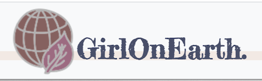
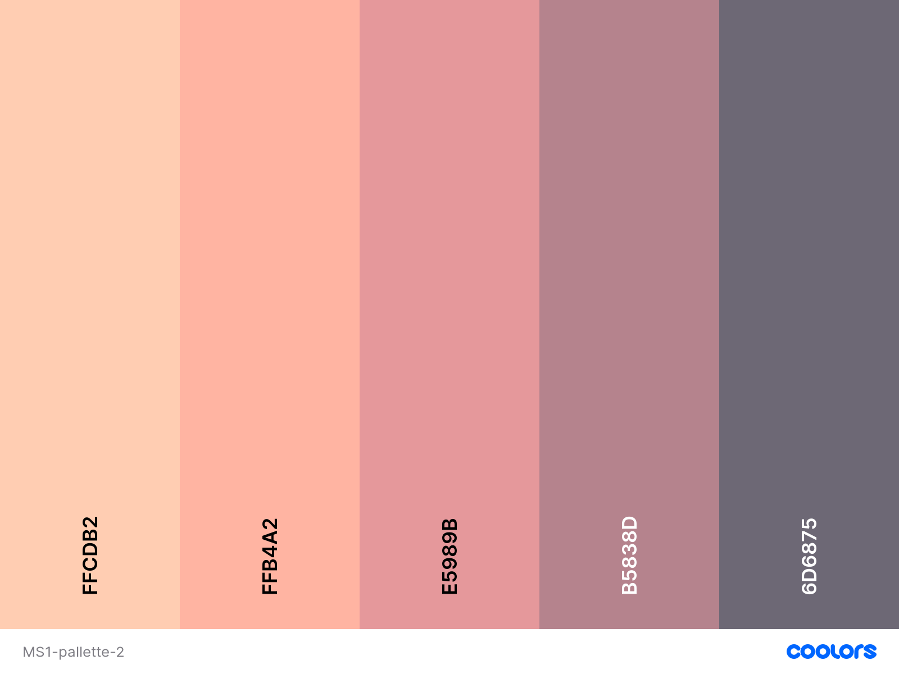

# Girl On Earth.

## Table of Contents
1. [About](#about)
2. [Users Experience (UX)](#user-experience)
3. [Design](#design)
4. [Features](#feature)
5. [Technologies Used](#Technologies-used)
7. [Testing](#testing)
8. [Debugging](#debugging)
8. [Deployment](#Deployment)
9. [Credits](#credits)

## 1. About

GirlOnEarth. is a website created for a female meet-up group. The purpose of the group is to gathering like-minded female individuals sharing the same values and metaphors about life, empowering each other to live their life to the maximum, dream big and trive! 

I have moved to Ireland since the age of 20, ever since then I have been busy surviving, studying and working, having a family and raising kids, it has been non-stop. Until Covid hit in March last year, everything has paused, finally, I relized that I haven't been living my life (the life we all get to live for once and only once!) It was the awaken moment of my life, from then my focus was shifted onto self-love, self-improvement, mindfulness...   

So, there you go! As a single mother , a beautician, and a person that right in the middle of the awaken moment, I came up with this idea for my Milestone project 1 for the full stack web development course at [code institute](https://codeinstitute.net/). 

Main requirements
* Write custom HTML5 and CSS3 code to create a website of at least 3 pages, or (if using a single scrolling page), at least 3 separate page areas.
* Incorporate a main navigation menu and structured layout.
* Incorporate a main navigation menu and structured layout and use Git & GitHub for version control.

Live project website can be accesed here.

Repository for this project can be accesed here.

## 2. Users Experience (UX)

#### 2.1 Users stories

As a user and a woman with high living standards, my goal is to live a substainable life, my aim is to find a like-minded group of people, so that I can surround myself with people who can inspire, activate and uplifting me.

#### 2.2 The Five Planes of UX

* ##### Strategy Plane

  **The aim** is to attract women with the same mindset join the group to form a community filled with positive energy, inspire and uplift each other, to serve the bigger community we live in.

  **The target audience** is female individuals that have a strong mindset, knowing what they want to achieve in life and aiming to live their life to the maxmium.

* ##### Scope Plane

  **The home page** should include an eye catching feature with an insparational metaphors to draw users attendation immediately. **The passions section** should include a few of the topics around daily life would interest our female audience. It would be ideal if there are acticles could be linked to this section, but for now the page can be just inclule a basic scope, it can be added as the page grows. **The Acitivities** section should be divided into 3 columns, with a round shape image clearly tell the users what is happening on a regular basis. **The contact page** should include a form so that the user can get in touch with us.

* ##### Structure Plane
  
  The page is going to a single page with five sections, with a header containers a brand image, a brand name and a navigatiion bar. The home page section structured on the top of the page, followed by an about section clarify what's this page is about. The next section is divided by six topics displayed with images and quotes. The following is the activities section, it's a section with 3 columns clearly laid out. Then finally there is a contact form for the useers to fill up if they are interested to join in the group. Close the page with a footer has social links and copyright information, also another links for the contact form.

* ##### Skeleton Plane
  The goal is to achieve a clean visual effect with the entire page with as less text as possible, using simple and calming images to deliver the "go with the flow" effect. The navigation system should be simple and clear, with five sections fixed on the top of the page, when the users click, it will bring them straight to the relevant sectiion. You can find a wireframe draw-up in the Mockups section.

* ##### Surface Plane
  Becasue of our audience is female individuals, our color theme will be light and girly, images should be feminine, fonts will also be delicate. Minimise the content is the goal, to create a calming sensation throughout the page.

## 3. Design

#### 3.1 Colours

The above color pallate will be the main color theme throughout the page. 

#### 3.2 Typograhpy

"Architects Daughter", "Bungee Outline", "Teko", "Yanone Kaffeesatz", "Fredericka the Great","Audiowide" and "Shadows Into Light" are the fonts I used throughout the page. The are all from [Google Font](https://fonts.google.com/).

#### 3.3 Imagery
Througout the project, I am aiming for images that has natural color, easy on the eyes, to create a soothing sensation.
please see in the credit section for links to images sources.

#### 3.4 Mockups
[wireframes](assets/wireframes/ms1.pdf)

## 4. Features

#### 4.1 Existing Features

The site is a one-page site divided by five sections, include *home*, *about*, *passions*, *acitivities*, and *contact*. The layout of the page also completed by its responsive navbar, footer and two dividers to ensure a balanced visual effect.
#### Navbar
The responsive navbar has been achieved by Implementing bootstrap 4, it collapes into a button when the screen smaller than 990px. It contains links to all sections, and the logo of the page. The logo also used as a homepage link.
#### Homepage
The homepage contains a main image, a title quote and a button. I used CSS animation to make the quote sliding from left to right as soon as the page is loading, then the button "starts now" appears 2 second later. The aim here is to grab users' attendation, make the site appealing.
#### About
The about section contains two images and the a paragraph describing what the page is all about, so the users can have a clear view of what they can get from using the page. The section's visual effect is achieved by using CSS position and overflow.
#### Passions 
This section contains 6 images and a title with a quote,  explaining what topics the group is focusing on, gives the user a general idea about the passions what we might have in common. I used CSS grid to make this section completely responsive for all different screen sizes.
#### Acitivities
This section gives the user an idea about what acitivities we are going to do together to reach our goals. It contains 3 small sections with an image and time and place each event is happening. 
#### Contact
The contact section contains a form, which gathering users informaton, includes users' first and last name, email address and a text field for them to leave a message. A submit button is also included. Although at the moment, there's no backend attached to the site, but by the time I finish this course, I would be able to Implement such feature.
#### Dividers
There are two individual dividers divides the page into sections, inside the divider, there's a motivational quote.
#### Footer
The footer has been divided into three sections, which is contact link, social icons links and copyright. 

#### 4.2 Features Left to Implement

As the course progress, I would love to add additional features to this page, for example, adding intereting acticles and links into each passions, subscribe users onto email list. so whenever there's an update on the page or new articles, they will be notified. All the backend features will be Implemented by the time I finished this course, such as users' information etc.

## 5. Technologies Used

#### 5.1 Languages Used

* HTML/HTML5 provides basic Structure of the website.
* CSS/CSS3 provides colors, layout and visual effect of the page.

#### 5.2 Frameworks, Libraries and Programs Used

* Bootstrap4 - helped created a responsive navbar and some sections structures throughtout the page.
* Gitpod - README, git version control and  all code was written in Gitpod using code institute gitpod full template.
* GitHub - hosting service to save the project in a repository.
* Balsamiq - wireframes.
* [TinyPNG.com](https://tinypng.com/) - used to compress large images.

## 6. Testing

#### 6.1 Functiionality Testing

#### 6.2 CSS3 validator

#### 6.3 HTML5 validator

#### 6.4 Usability Testing

#### 6.5 Compatibility Testing

#### 6.6 Performance Testing

##### 6.6.1 Tested on Developer Tools Lighthouse

##### 6.6.2 A Lighthouse report in Chrome DevTools

## 7. Debugging

## 8. Deployment

## 9. Credits

#### 9.1 Content

#### 9.2 Media

#### 9.3 Acknowledgements

